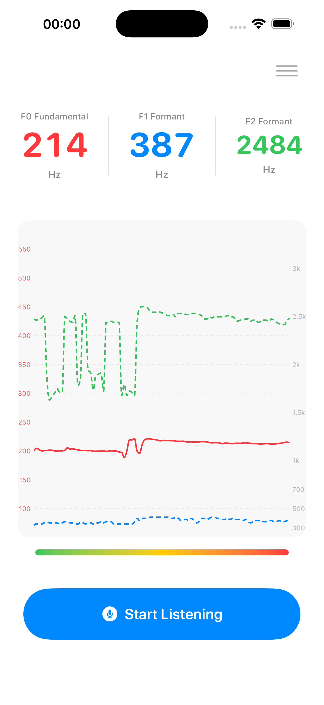
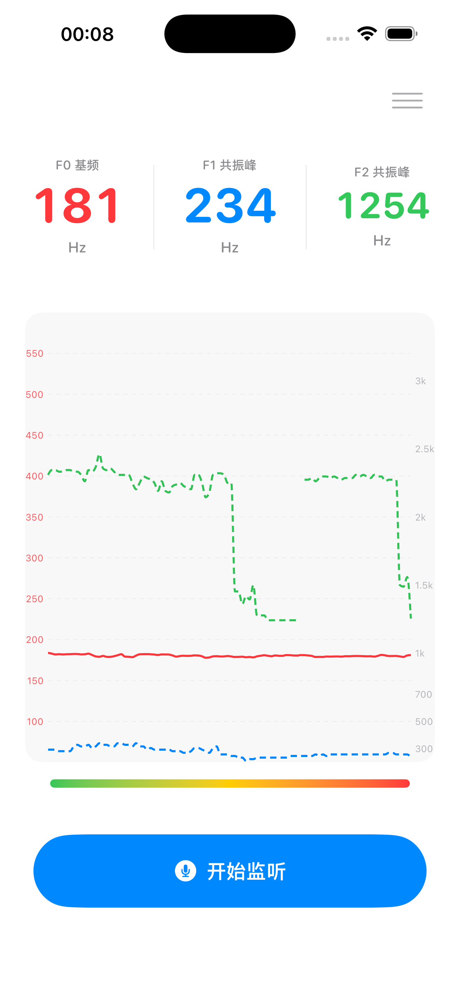

# FormantScope

**[English](#english)** · **[简体中文](#简体中文)**

---

## English

  

<em>Listening view · English UI — click image to open full size</em>

FormantScope is a SwiftUI app for iOS and macOS that captures live microphone input and shows speech acoustics in real time: **F0** (fundamental frequency), **F1** and **F2** (first and second formants), and an amplitude level. A rolling, time-windowed history (default 8 s, adjustable 2–20 s) is drawn as a full-screen chart behind the readouts — F0 on the left scale, F1/F2 on the right scale, and a time axis along the bottom.

### Features

- Live F0 / F1 / F2 readouts, each with a window average, plus an amplitude meter
- Full-screen background chart — F0 solid red, F1 blue dashed, F2 green dashed (each formant curve can be hidden)
- **Settings** — toggle F1/F2; edit the F0 and shared F1/F2 axis ranges; set the chart time window 2–20 s (persisted via `AppStorage`)
  - iOS: toolbar button opens a sheet
  - macOS: standard **Settings** (**⌘,**) plus **View** menu toggles (**⌥⌘1**, **⌥⌘2**)
- **WAV recording** — while listening, **Record** writes `formantscope-YYYYMMdd-HHmmss.wav` into a folder you choose once per device (security-scoped bookmark); a toast shows the saved path
- iOS: listening stops automatically when the app goes to the background

### How it works

- **F0** comes from AudioKitEX **PitchTap** (AUBIO), with voice gating and onset/hold/jump smoothing.
- **F1 / F2** come from a custom LPC pipeline (RMS gate → Hamming window → downsample → autocorrelation → Levinson–Durbin → spectral envelope → peak picking). F2 selection is F1-aware so a low F1 (e.g. /a/) is not mistaken for F2.
- The audio graph forks taps to avoid the one-tap-per-bus limit: PitchTap on the mic, RawDataTap on an inner mixer for LPC, and a separate record mixer for the WAV tap. A `Fader` at gain 0 keeps the output path silent.

Implementation details — DSP parameters, smoothing thresholds, and platform differences — are documented inline in `AudioAnalyzer.swift`.

### Tech stack

Swift / SwiftUI · AVFoundation · Accelerate (vDSP) · Swift Charts · AudioKit / AudioKitEX / SoundpipeAudioKit (SPM)

### Getting started

**Requirements:** Xcode 16+, iOS 17+ / macOS 14+, a microphone (and an Apple Developer account to run on a physical iOS device).

1. Open `FormantScope.xcodeproj`
2. Select the **FormantScope** scheme and a run destination (My Mac, an iOS Simulator, or a connected device)
3. **Product → Run** (**⌘R**), then allow microphone access
4. Tap **Start Listening**. Optionally pick a recording folder in Settings, then **Record** / **Stop Recording** for WAV.

### Contributing

Contributions are welcome. For larger changes, open an issue first so scope and design stay aligned.

### License

Released under the [MIT License](LICENSE).

---

## 简体中文

  

<em>主界面聆听视图 · 中文界面 — 点击图片查看原图</em>

FormantScope 是一款面向 iOS 与 macOS 的 SwiftUI 应用，实时采集麦克风并显示语音声学参数：**F0**（基频）、**F1**/**F2**（第一、第二共振峰）与振幅电平。按**时间窗**滚动的历史（默认 8 秒，可在 2–20 秒间调整）以全屏折线图绘制在读数背后——左轴 F0、右轴 F1/F2，底部为时间轴。

### 功能特性

- 实时 F0 / F1 / F2 读数，各自附窗内平均值，并配振幅条
- 全屏背景图：F0 红色实线、F1 蓝色虚线、F2 绿色虚线（可分别关闭）
- **设置**：F1/F2 显示开关；F0 与 F1/F2 共用轴范围；图表时间窗 2–20 秒（通过 `AppStorage` 持久化）
  - iOS：右上角工具栏按钮弹出 Sheet
  - macOS：系统 **设置（⌘,）**，以及 **显示** 菜单开关（**⌥⌘1**、**⌥⌘2**）
- **WAV 录音**：聆听中点击 **Record**，写入 `formantscope-YYYYMMdd-HHmmss.wav`；目录一次性选定（security-scoped 书签），保存后浮层显示路径
- iOS：进入后台自动停止聆听

### 工作原理

- **F0** 来自 AudioKitEX **PitchTap**（AUBIO），配合有声门控与起停、跳变平滑。
- **F1 / F2** 来自自实现的 LPC 流水线（RMS 门控 → Hamming 窗 → 降采样 → 自相关 → Levinson–Durbin → 谱包络 → 峰值拾取）。F2 选取为 F1-aware，避免把偏低的 F1（如 /a/）误判为 F2。
- 音频图分叉挂 tap 以规避「每 bus 仅一个 tap」限制：PitchTap 挂麦克风，RawDataTap 挂内层 mixer 做 LPC，另有独立的录音 mixer 挂 WAV tap；末端经 `Fader(0)` 静音输出。

实现细节——DSP 参数、平滑阈值、平台差异——均在 `AudioAnalyzer.swift` 中以注释记录。

### 技术栈

Swift / SwiftUI · AVFoundation · Accelerate（vDSP）· Swift Charts · AudioKit / AudioKitEX / SoundpipeAudioKit（SPM）

### 快速开始

**环境要求：** Xcode 16+、iOS 17+ / macOS 14+、麦克风（在实体 iOS 设备上运行还需 Apple Developer 账号签名）。

1. 打开 `FormantScope.xcodeproj`
2. 选择 **FormantScope** scheme 与运行目标（My Mac、iOS 模拟器或已连接设备）
3. **Product → Run（⌘R）**，允许麦克风权限
4. **开始聆听**。可在设置中选择录音目录，再用 **Record** / **Stop Recording** 保存 WAV。

### 贡献

欢迎贡献代码或反馈。若涉及较大重构或新特性，建议先提交 issue，约定范围与设计。

### 许可

本项目基于 [MIT 许可证](LICENSE) 开源。
